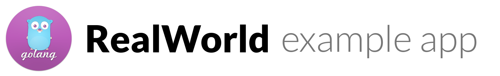

# 

> ### [Go] codebase containing real world examples (CRUD, auth, advanced patterns, etc) that adheres to the [RealWorld](https://github.com/gothinkster/realworld) spec and API.

### [Demo](https://github.com/gothinkster/realworld)&nbsp;&nbsp;&nbsp;&nbsp;[RealWorld](https://github.com/gothinkster/realworld)

This codebase was created to demonstrate a fully fledged fullstack application built with **[Go Language]** including CRUD operations, authentication, routing, pagination, and more.

We've gone to great lengths to adhere to the **[Go Language]** community styleguides & best practices.

For more information on how to this works with other frontends/backends, head over to the [RealWorld](https://github.com/gothinkster/realworld) repo.

# How it works

> Describe the general architecture of your app here

# Getting started

1. Install Go - https://golang.org/doc/install
1. Getting familiar with the environment
    - [How to write go code](https://golang.org/doc/code.html)
    - [Effective Go](https://golang.org/doc/effective_go.html)
